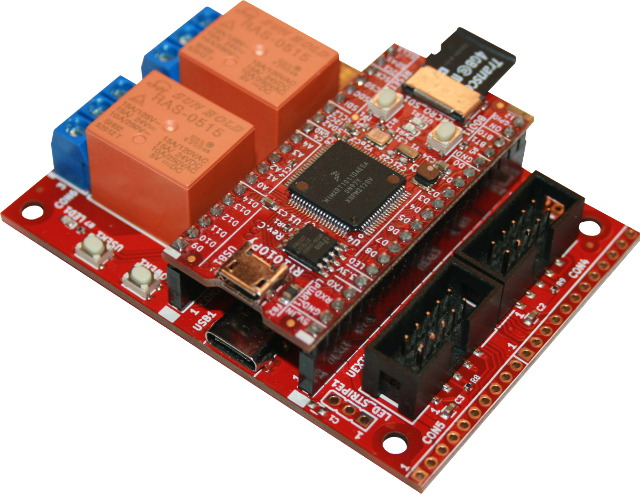

# RT10100Py
RT1010Py is Cortex-M7 running at 500Mhz MicroPython board

https://www.olimex.com/Products/MicroPython/RT1010-Py/open-source-hardware


The RT1010-Py can also be used together with its DevKit board 

https://www.olimex.com/Products/MicroPython/RT1010Py-DevKit/open-source-hardware




## Features
* MIMXRT1011DAE5A running at 500Mhz
* 128KB on board RAM
* 2MB SPI Flash
* Three UARTs
* Two hardware SPIs
* Two hardware I2Cs
* One hardware I2S
* Four PWM units with complementary outputs for push-pull drivers
* USB 2.0 OTG
* Micro SD card connector
* RTC with 32.768 kHz crystal
* RESET button
* BOOT button
* UEXT connector with 3.3V, GND, I2C, SPI, and UART
* Two GPIOs headers spaced at 22.86 mm (0.9”)
* Dimensions: (53.34 x 25.4)mm (2.1 x 1)”

## Library

The library must be copied on the MicroPython board before using some of the examples.

### MicroPython MIP Installer


On a WiFi capable plateform:

```
>>> import mip
>>> mip.install("github:OLIMEX/RT1010Py")
```

Or via the mpremote utility :

```
mpremote mip install github:OLIMEX/RT1010Py
```

### Manual installation

Copy all the files from __OLIMEX/RT1010Py/lib__ repository to your MicroPython board under __/lib__ directory.

## Documentation

Check the files in OLIMEX/RT1010Py/__DOCUMENTS__ for ressources:

* [RT101-0Py User Manual](DOCUMENTS/RT1010Py-user-manual.pdf) (pdf)
* [RT1010-Py PinOut](DOCUMENTS/RT1010-py-pinout.jpg) (jpg)
* [RT1010-py board](DOCUMENTS/RT1010-py-board.png) (png, for drawing circuit)
* and some other

Also check the RT1010Py-DevKit user manual at [OLIMEX/RT1010Py-DevKit repository](https://github.com/OLIMEX/RT1010Py-DevKit/tree/main)

## Licensee
* Hardware is released under Apache 2.0 Licensee
* Software is released under GPL3 Licensee
* Documentation is released under CC BY-SA 3.0
