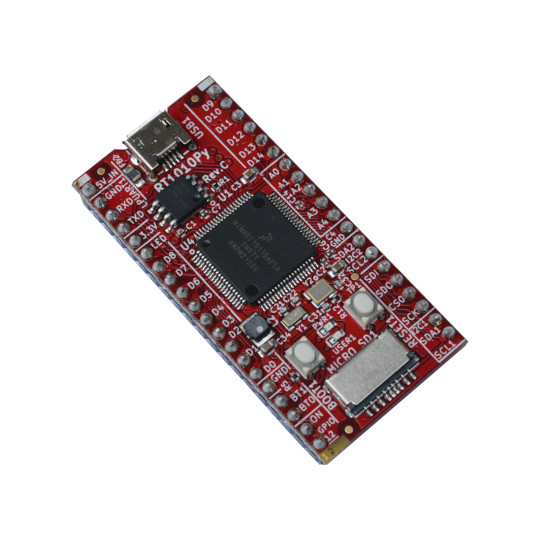

# RT10100Py
RT1010Py is Cortex-M7 running at 500Mhz MicroPython board

https://www.olimex.com/Products/MicroPython/RT1010-Py/open-source-hardware

## Features
* MIMXRT1011DAE5A running at 500Mhz
* 128KB on board RAM
* 2MB SPI Flash
* three UART
* two hardware SPI
* two hardware I2C
* one hardware I2S
* four PWM units with complementary outputs for push pull drivers
* USB 2.0 OTG
* micro SD card connector
* RTC with 32.768 kHz crystal
* RESET button
* BOOT button
* fUEXT connector with 3.3V, GND, I2C, SPI, and UART
* two GPIOs headers spaced at 22.86 mm (0.9”)
* Dimensions: 53.34 x 25.4 mm ( 2.1 x 1”)

## Licensee
* Hardware is released under Apache 2.0 Licensee
* Software is released under GPL3 Licensee
* Documentation is released under CC BY-SA 3.0
